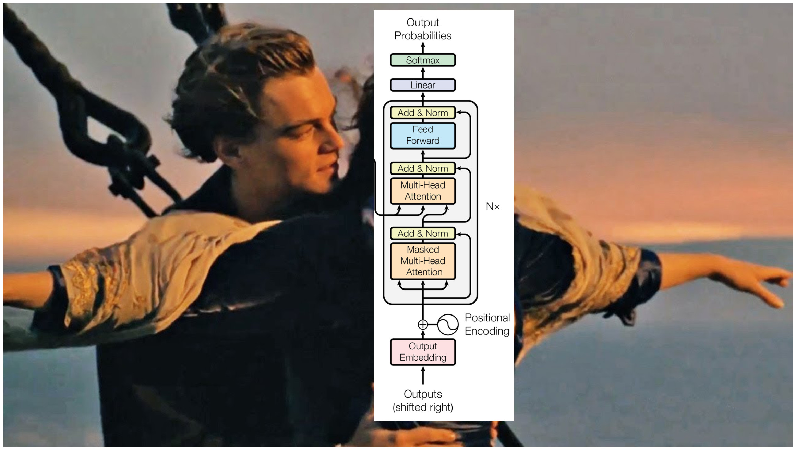

# nn-zero-to-hero

  
  
<em>Andrej's channel banner on YouTube</em>

## Lectures

**Lecture 1: The spelled-out intro to neural networks and backpropagation: building micrograd**

- [YouTube video lecture](https://www.youtube.com/watch?v=VMj-3S1tku0)
- [Jupyter notebook files](lectures/micrograd)
- [micrograd Github repo](https://github.com/karpathy/micrograd)
- [My exercise solution](exercises/01_micrograd.ipynb)

---

**Lecture 2: The spelled-out intro to language modeling: building makemore**

- [YouTube video lecture](https://www.youtube.com/watch?v=PaCmpygFfXo)
- [Jupyter notebook files](lectures/makemore/makemore_part1_bigrams.ipynb)
- [makemore Github repo](https://github.com/karpathy/makemore)
- [My exercise solution](exercises/02_makemore.ipynb)

---

**Lecture 3: Building makemore Part 2: MLP**

- [YouTube video lecture](https://youtu.be/TCH_1BHY58I)
- [Jupyter notebook files](lectures/makemore/makemore_part2_mlp.ipynb)
- [makemore Github repo](https://github.com/karpathy/makemore)
- [My exercise solution](exercises/03_makemore_mlp.ipynb)

---

**Lecture 4: Building makemore Part 3: Activations & Gradients, BatchNorm**

- [YouTube video lecture](https://youtu.be/P6sfmUTpUmc)
- [Jupyter notebook files](lectures/makemore/makemore_part3_bn.ipynb)
- [makemore Github repo](https://github.com/karpathy/makemore)
- [My exercise solution](exercises/04_makemore_batchnorm.ipynb)

---

**Lecture 5: Building makemore Part 4: Becoming a Backprop Ninja**

- [YouTube video lecture](https://youtu.be/q8SA3rM6ckI)
- [Jupyter notebook files](lectures/makemore/makemore_part4_backprop.ipynb)
- [makemore Github repo](https://github.com/karpathy/makemore)
- [My exercise solution](exercises/05_makemore_backprop_ninja.ipynb)

---

**Lecture 6: Building makemore Part 5: Building WaveNet**

- [YouTube video lecture](https://youtu.be/t3YJ5hKiMQ0)
- [Jupyter notebook files](lectures/makemore/makemore_part5_cnn1.ipynb)
- [My exercise solution](exercises/06_makemore_wavenet.ipynb)

---

**Lecture 7: Let's build GPT: from scratch, in code, spelled out.**

- [YouTube video lecture](https://www.youtube.com/watch?v=kCc8FmEb1nY)
- [My exercise solution](exercises/07_gpt.ipynb)

---

**Lecture 8: Let's build the GPT Tokenizer**

- [YouTube video lecture](https://www.youtube.com/watch?v=zduSFxRajkE)
- [minBPE code](https://github.com/karpathy/minbpe)
- [Google Colab](https://colab.research.google.com/drive/1y0KnCFZvGVf_odSfcNAws6kcDD7HsI0L?usp=sharing)
- [My exercise solution](exercises/08_tokenizer.ipynb)

---

**Lecture 9: TODO**
